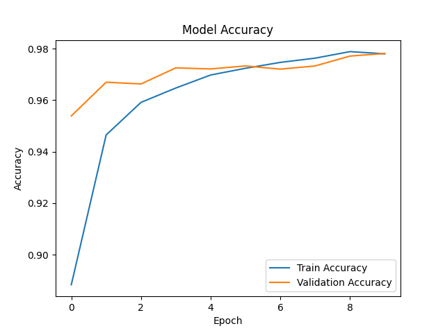
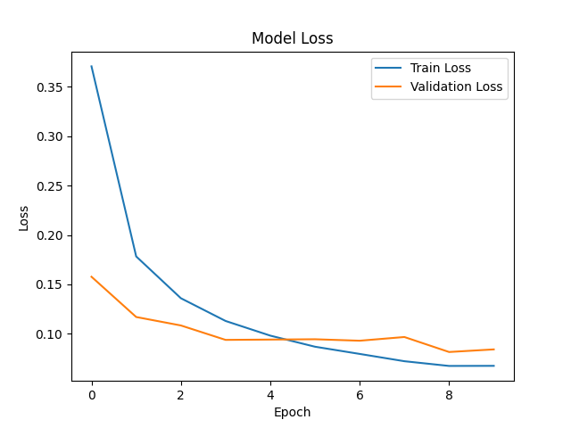
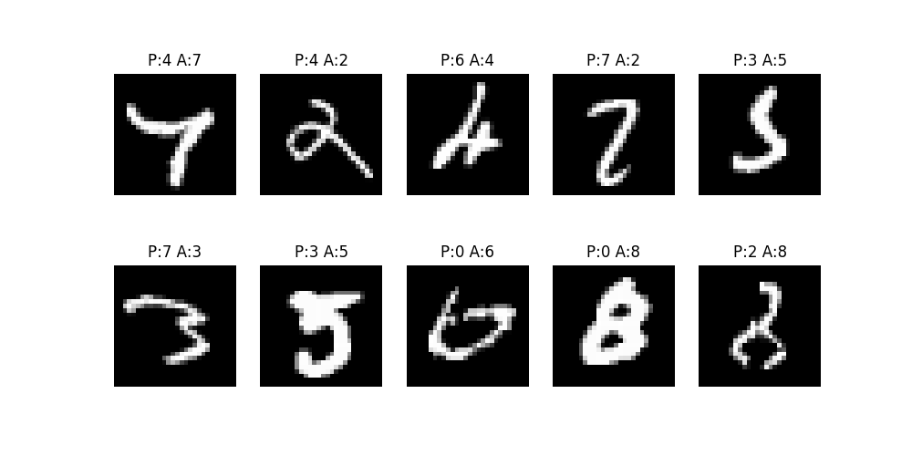

# 🧠 Handwritten Digit Classification using ANN

An Artificial Neural Network (ANN)-based project that classifies handwritten digits (0–9) using the MNIST dataset.

This project demonstrates a **complete Deep Learning pipeline** including data preprocessing, model training, evaluation, visualization, and error analysis.

---

## 🚀 Features

* Classifies handwritten digits using ANN
* End-to-end ML pipeline implementation
* Model evaluation using accuracy
* Visualization of training performance
* Error analysis on misclassified images

---

## 📊 Dataset

The dataset used is **MNIST (Modified National Institute of Standards and Technology)**.

* Total samples: 70,000
* Image size: 28 × 28 (grayscale)
* Classes: 10 (digits 0–9)

---

## 📊 Output Visualizations

### Accuracy & Loss




---

### Wrong Predictions



---

## 🧠 Deep Learning Pipeline

This project follows a complete workflow:

1. Data Loading
2. Data Preprocessing (Normalization)
3. Model Building (ANN)
4. Model Training
5. Model Evaluation
6. Visualization
7. Error Analysis

---

## 🤖 Model Used

**Artificial Neural Network (ANN)**

Architecture:

* Input: 28 × 28 image (flattened inside the model)
* Hidden Layers: Dense layers with ReLU activation
* Output Layer: 10 neurons with Softmax

---

## 📊 Results

* Accuracy: ~98%
* Stable training with minimal overfitting

---

## ❌ Error Analysis

* Misclassification occurs between visually similar digits:

  * 3 ↔ 5
  * 4 ↔ 9
  * 8 ↔ 3 / 9

* Reasons:

  * Similar shapes
  * Handwriting variations
  * Loss of spatial information due to flattening

---

## ⚠️ Limitations

* ANN does not capture spatial relationships in images
* Performance saturates around ~98%
* Struggles with complex patterns

---

## 🚀 Future Improvements

* Use CNN for better performance
* Hyperparameter tuning
* Add regularization techniques
* Deploy using FastAPI / Streamlit

---

## 🛠 Tech Stack

* Python
* TensorFlow / Keras
* NumPy
* Matplotlib
* Scikit-learn

---

## 💻 Run the Project Locally

### 1️⃣ Clone the repository

```bash
git clone https://github.com/Aryan-222005/handwritten-digit-classification-ann
```

### 2️⃣ Navigate to the project folder

```bash
cd mnist-ann-project
```

### 3️⃣ Install dependencies

```bash
pip install -r requirements.txt
```

### 4️⃣ Run the project

Open `mnist_ann.ipynb` and run all cells.

---

## 📂 Project Structure

```
mnist-ann-project
│
├── outputs
│   ├── accuracy_plot.png
│   ├── loss_plot.png
│   ├── wrong_predictions.png
│
├── mnist_ann.ipynb
├── requirements.txt
├── README.md
└── .gitignore
```

---

## 🧠 Key Learnings

* ANN performs well for simple image classification (~98%)
* Data preprocessing (normalization) is crucial
* Error analysis helps understand model limitations
* CNN is better suited for image-based tasks

---

## 👨‍💻 Author

Aryan Singh
B.Tech CSE (AI/ML & Analytics)

---

## ⭐ If you found this useful

Give it a star ⭐ and share your feedback!
